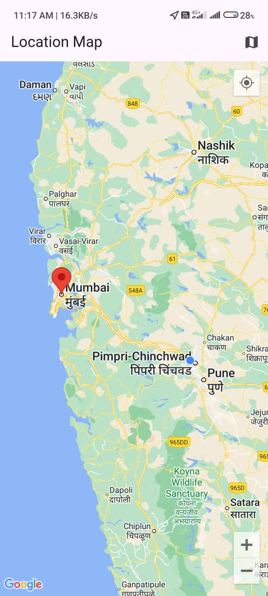

# Simple Location-Based Flutter App

### Note:
The Google Maps API key has been **removed from the code** for security reasons. Previously, the project used the `flutter_config` package to securely store and inject the API key into the `AndroidManifest.xml` and iOS configurations and flutter places api key. However, due to compatibility issues with this specific project, `flutter_config` is not functioning as expected. 

Please note that **`flutter_config` works fine in my other projects**, so this issue seems to be isolated to this particular setup. As a workaround, you will need to manually add your API key directly into the relevant sections of the code (such as the `AndroidManifest.xml` file for Android or `AppDelegate.swift` for iOS and lib/core/api.dart).

## Objective

This Flutter app allows users to input a location (city name, address, or coordinates) and display it on a map. The app is designed to demonstrate user input handling, map integration, and following best coding practices.

## App Features

### 1. First Screen: Location Input
- The first screen prompts the user to enter a location (such as a city name, address, or coordinates).
- The input is validated to ensure the field is not empty.
- A button is provided to navigate to the next screen after the location is entered.

### 2. Second Screen: Display Location on Map
- The second screen loads a map and displays the location entered by the user from the first screen.
- A marker is placed at the entered location.
- The map integration can be done using the `google_maps_flutter` package or any other suitable map package.

## Overall Guidelines
- **Code Quality:**
  - The code follows standard coding practices, with clean and modular structure.
  - Necessary comments are added to explain the purpose of functions, classes, or code blocks.
  - The project is properly structured with separation of concerns (screens, logic, and services).
  
- **State Management:**
  - Basic state management is used to manage the location input and display it on the map.

- **Error Handling:**
  - Graceful error handling is implemented, including handling invalid or non-existent locations.

## Bonus Features (Optional)
- Ability to switch between different map types (e.g., satellite, terrain).
- Option to detect and display the user’s current location on the map.

## Screenshots

| Location Input Screen | Map Display Screen |
| --------------------- | ------------------ |
|  |  |

## How to Run the App

### Prerequisites

1. **Flutter SDK:**  
   Ensure you have Flutter installed on your machine. You can follow the official installation guide [here](https://docs.flutter.dev/get-started/install).

2. **Google Maps API Key:**  
   You'll need to obtain a Google Maps API key to enable map functionality. Instructions can be found [here](https://developers.google.com/maps/documentation/android-sdk/get-api-key).

3. **Android/iOS Emulator or Physical Device:**  
   You should have an emulator or a physical device connected to your machine.

### Steps to Run

1. **Clone the repository:**
   ```bash
   git clone https://github.com/DarpanNeve/ridesense
   cd ridesense
   flutter pub get
   flutter run
   
